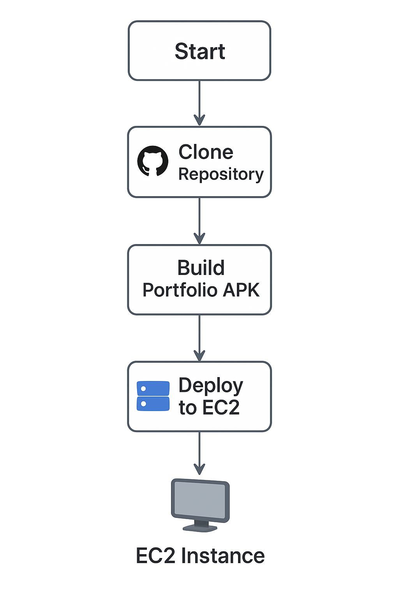
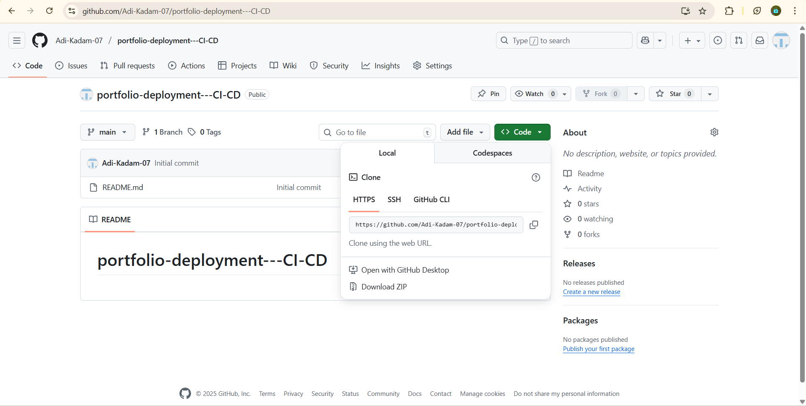
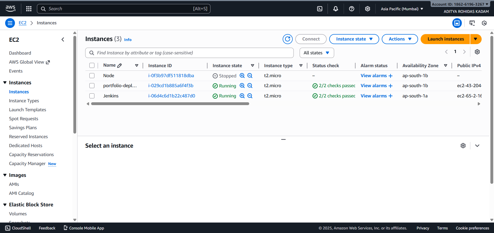
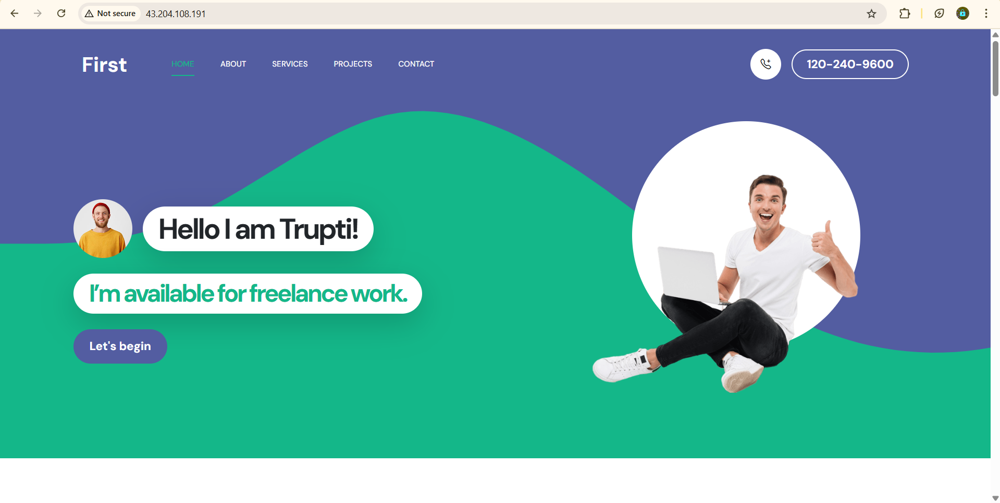

# Portfolio App (Android) — Jenkins CI/CD Deployment

> **Automated deployment of Portfolio APK using Jenkins and Apache Server on AWS Instances**

## Project Overview

This project demonstrates how to **deploy a portfolio APK** using **Jenkins CI/CD** with **two AWS EC2 instances** — one for Jenkins automation and another for Apache web hosting.



## Infrastructure Setup

### Step 1 — Launch AWS Instances
- **Instance 1:** `portfolio-deploy` (for hosting portfolio project)
- **Instance 2:** `jenkins` (for Jenkins automation)


### Step 2 — Configure Instances
- On **portfolio-deploy** instance:
  - Installed **Apache web server** using:
    ```bash
    sudo apt update
    sudo apt install apache2 -y
    ```
- On **jenkins** instance:
  - Installed and configured **Jenkins**.
  - Verified Jenkins running on default port `8080`.

##  step 3 — Prepare the Project

1. Cloned the **Portfolio APK Project** from GitHub:
   ```bash
   git clone https://github.com/yourusername/portfolio-apk.git

## Step 3 — Prepare the Project

### Clone the Portfolio APK Project from GitHub:

#### git clone https://github.com/yourusername/portfolio-apk.git


## step 4 — Jenkins CI/CD Pipeline Setup

### Open Jenkins dashboard → click New Item → select Pipeline.

### Name the job: portfolio-deployments.

### In configuration:

### Select Pipeline script from SCM.

### Set SCM → Git.

### Add Repository URL:
##### https://github.com/yourusername/portfolio-apk.git

### Set Branch: main.

### Save the job configuration.

## Step 5 — Build and Deploy

### Click Build Now in Jenkins.

### The Jenkins pipeline will automatically:

### Clone the GitHub repository.

### Build the APK using Gradle.

### Deploy it to the Apache server running on the portfolio-deploy instance.

### Once the build is successful, copy the public IP of your portfolio-deploy instance.

### Open the IP in your browser to access the live portfolio.

## Example:

### http://<portfolio-deploy-public-ip>


## ✅ Portfolio successfully deployed and accessible via browser.

## Screenshots








## Sumary :-

| Component                         | Purpose                                  |
| --------------------------------- | ---------------------------------------- |
| **Jenkins EC2 Instance**          | Handles CI/CD automation                 |
| **Portfolio-Deploy EC2 Instance** | Hosts the portfolio project using Apache |
| **GitHub Repository**             | Stores source code and Jenkinsfile       |
| **VS Code**                       | Used to edit Jenkinsfile and source code |
